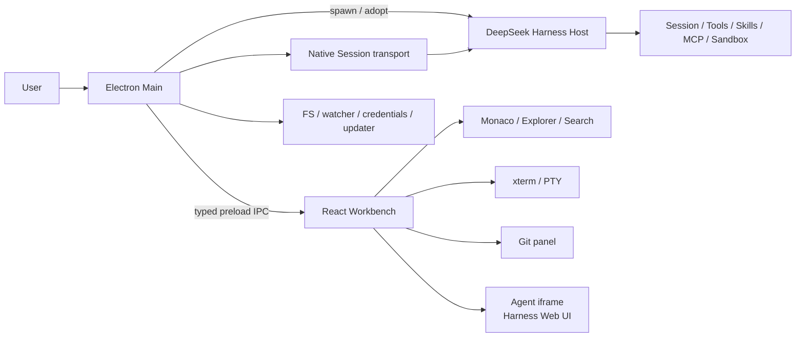

# DeepSeek Harness Desktop

> **The local-first, plugin-friendly, Cursor-style AI coding workbench for DeepSeek Harness users.**
>
> **Unofficial community project** · **source preview** · not the official DeepSeek Desktop application and not endorsed by DeepSeek.

[中文](README.md) · [Market research](docs/market-research.md) · [Roadmap](docs/roadmap.md) · [Architecture](docs/architecture.md) · [AI agent guide](docs/agent-development.md)

[](https://github.com/davidtan2008/deepseek-harness-desktop/actions/workflows/ci.yml)
[](LICENSE)

## Why this project exists

DeepSeek Harness is a composable agent runtime: the model supplies reasoning, while Harness supplies tools, skills, sessions, permissions, sandboxing, and a real workspace. DHD does not reimplement that runtime. It provides a daily developer workbench around it:

```text
open a repository → attach context → run an agent → review changes → run tests → commit or revert
```

The long-term product direction is a **Harness-native agent IDE control plane**, not a browser wrapper:

- preserve Harness Sessions, Trajectory, Skills, MCP, approvals, and tools;
- bring editor, terminal, Git, search, and Agent work into one local window;
- make provider/transport capabilities explicit and replaceable;
- make every process, watcher, search, PTY, and Host generation recoverable;
- keep project data and credentials local by default.

## Current status

This repository is a **0.1.0 source preview**, not a signed production distribution.

| Status | Capability |
|---|---|
| Implemented and manually checked | Host lifecycle, file tree/editor, search with fallback, PTY with fallback, basic Git, workspace sync, coordinated shutdown |
| Implemented without outer automated regression | Monaco tabs, command palette, MCP/Rules entry points, inline edit, layout persistence |
| Upstream capability | Harness presets, Trajectory, tool cards, Skills, MCP, Sessions, subagents/fork/workflow/experimental Agent Teams inside the iframe |
| Early native vertical slice | Main-owned Session runtime, structured context/prompts, and tool/approval/change events after workspace sync; real provider/model review is not complete |
| Planned | Per-turn before/after diff, provider/agent roster, worktree isolation, bundled runtime, signed release/update channel |

Important current limits:

- The full default Agent surface remains a tokenized Harness Web UI **iframe**; after workspace sync DHD attempts to attach native controls to the same Host/Session, but this is not a completed native `dsh-client` embedding.
- Selection handoff uses structured Session context when the native channel is available; iframe/clipboard handoff remains an explicit fallback.
- The Changes panel is still repository-level Git diff; native `change-projection` currently exposes changed paths only.
- Desktop `defaultModel`, `defaultPreset`, and `sandboxMode` are not automatically Host-effective settings.
- The current package does not bundle a complete Harness/Node runtime; a packaged Host fails closed when the runtime manifest is incomplete instead of silently falling back to system Node/npx.
- The outer repository has no complete unit/E2E suite; `pnpm test:contract` covers capability, IPC/preload, Host IPC/Session fixtures, and the static upstream Desktop compatibility gate; typecheck/build are not real provider/model tests.

See the version-bound [support matrix](docs/support-matrix.md) before making product claims.

## Run from source

Requirements: Node `^22.19.0` or `>=24`, pnpm `10.14.0`, Git submodules, and a built Harness checkout.

```sh
git clone --recursive git@github.com:davidtan2008/deepseek-harness-desktop.git
cd deepseek-harness-desktop
pnpm install
cd harness && pnpm install && pnpm run build && cd ..
pnpm doctor:env
pnpm dev
```

For parallel coding agents or worktrees, isolate the runtime:

```sh
DSH_HOME="$(mktemp -d)" \
DHD_USER_DATA="$(mktemp -d)" \
DHD_WORKBENCH_PORT=5183 \
DHD_ALLOW_MULTIPLE=1 \
pnpm dev
```

## Architecture



The Host is an external Node process. Main supervises it but does not execute Agent tools or directly write Session logs; the native runtime sends prompts and reads events through the Host Remote API. The Renderer has no Node integration and uses only the typed preload API. The exact lifecycle and private Host compatibility seams are documented in [docs/architecture.md](docs/architecture.md).

## Environment variables

| Variable | Purpose |
|---|---|
| `DHD_HARNESS_ROOT` | Select the Harness source checkout. |
| `DHD_HARNESS_URL` | Adopt a loopback `dsh web` URL; an adopted Host is not terminated by the desktop. |
| `DHD_NODE` | Select the Node executable used to launch an owned Host. |
| `DSH_HOME` | Select the Harness profile/session/credential home. |
| `DHD_USER_DATA` | Isolate Electron userData for development instances. |
| `DHD_WORKBENCH_PORT` | Select an isolated Vite renderer port. |
| `DHD_ALLOW_MULTIPLE=1` | Development-only bypass of the single-instance lock. |
| `DHD_ALLOW_REMOTE_HOST=1` | Explicit unsafe override for non-loopback Host URLs; avoid normal use. |
| `DHD_ALLOW_UNBUNDLED_RUNTIME=1` | Local diagnostic override for a packaged app without bundled Harness/Node; never use for releases. |
| `RIPGREP_PATH` | Select the ripgrep executable. |

## Documentation map

- [Market research](docs/market-research.md) — official philosophy, paper, competitors, and positioning.
- [Roadmap](docs/roadmap.md) — outcome-based phases and exit gates.
- [Architecture](docs/architecture.md) — as-built topology, contracts, lifecycle, and target seams.
- [Runtime manifest](docs/runtime-manifest.md) — generated runtime identity and bundled-dependency contract.
- [Upstream-first evaluation](docs/upstream-first-evaluation.md) — Desktop Host reuse spike and migration criteria.
- [Host IPC transport](docs/host-ipc-transport.md) — upstream lifecycle adapter and Session port seam.
- [AI agent development](docs/agent-development.md) — source-of-truth, parallel worktrees, checks, and handoff.
- [`llms.txt`](llms.txt) — compact machine-readable project index.
- [Support matrix](docs/support-matrix.md) — evidence and current limitations.
- [User guide](docs/user-guide.md) — source setup and troubleshooting.
- [Contributing](CONTRIBUTING.md) — development and Harness pin workflow.
- [Security](SECURITY.md) — current boundaries and private reporting.

## Checks

```sh
pnpm docs:check
pnpm upstream:check
pnpm typecheck
pnpm smoke:native-turn
pnpm test:contract
pnpm build
git diff --check
```

Run the release-only gate separately (the current source preview is expected to fail until the runtime is bundled):

```sh
pnpm release:check
```

Run real Host, PTY, search, shutdown, and packaging flows for changes that affect them. Report the exact commands run and any unverified platform; do not describe build success as runtime coverage.

## Upstream relationship

DHD is an independent community project. The pinned Harness checkout already contains an upstream Desktop implementation; DHD does not replace or represent it. It uses the upstream project as a pinned runtime and keeps desktop-specific behavior in this repository.

- [DeepSeek Harness](https://github.com/deepseek-ai/deepseek-harness)
- [Harness product philosophy](https://www.deepseek.com/harness/en/)
- [Cordis composability paper](https://arxiv.org/abs/2608.25512)

## License

MIT for this repository. Upstream and third-party components retain their own licenses; release work must produce complete notices and a runtime manifest.
