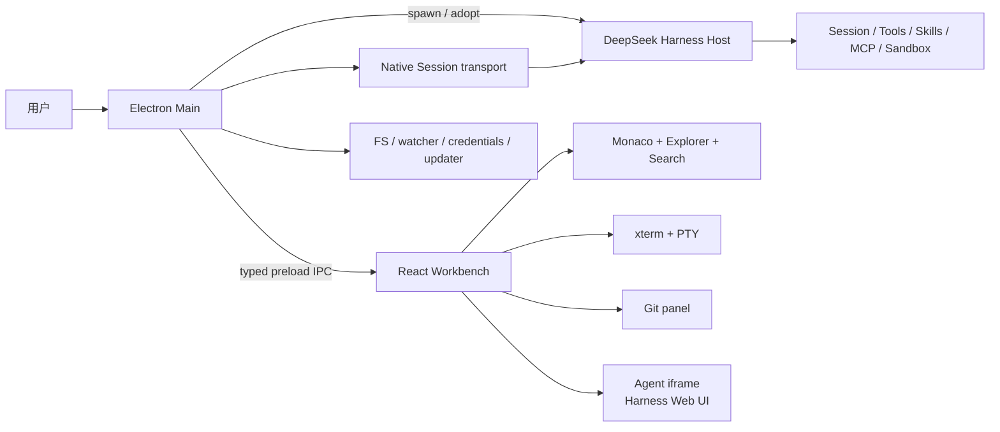

# DeepSeek Harness Desktop

> **面向 DeepSeek Harness 用户的本地优先、插件友好、Cursor 式 AI coding workbench。**
>
> **Unofficial community project** · **source preview** · 不是 DeepSeek 官方 Desktop，也不代表官方背书。

[](https://github.com/davidtan2008/deepseek-harness-desktop/actions/workflows/ci.yml)
[](LICENSE)

[English](README.en.md) · [市场调研](docs/market-research.md) · [路线图](docs/roadmap.md) · [架构](docs/architecture.md) · [AI Agent 开发指南](docs/agent-development.md)

## 为什么需要 DHD

DeepSeek Harness 已经是一个强大的、可组合的 Agent runtime：模型负责推理，Harness 负责工具、技能、会话、权限、沙箱和工作区。DHD 不重写它，而是把它放进一个开发者可以每天使用的本地工作台：

```text
打开仓库 → 选择上下文 → Agent 执行 → 审阅变更 → 运行测试 → 提交或回滚
```

我们希望 DHD 成为 **Harness-native 的 Agent IDE control plane**，而不是一个只能打开网页的 Electron 窗口：

- **保留 Harness 语义**：Session、Trajectory、Skills、MCP、审批和工具仍由上游 Host 负责。
- **Cursor 式工作流**：文件树、Monaco 编辑器、终端、Git、搜索、命令面板和行内编辑同屏工作。
- **本地优先**：项目、凭证和会话默认留在本机；外部 Host、远程访问和云服务必须显式选择。
- **可组合**：以版本化 Desktop capability、Host adapter 和未来的 ACP/CLI adapter 对接不同 coding agent。
- **可恢复**：进程、PTY、搜索、watcher、窗口和 Host 都有明确的 owner、取消和退出路径。

## 当前状态（请先读）

当前仓库是 **0.1.0 source preview**，不是已经完成签名/公证的安装包。

| 状态 | 能力 |
|---|---|
| 已实现并手工验证 | Electron Host 启停、文件树/编辑、搜索（含 fallback）、PTY（含 fallback）、Git 基础面板、workspace sync、统一退出清理 |
| 已实现但缺少外层自动化回归 | Monaco 多 Tab、命令面板、MCP/Rules 入口、行内编辑、窗口布局 |
| 上游能力 | Harness preset、Trajectory、工具卡、Skills、MCP、Session、subagent/fork/workflow/实验性 Agent Teams（在 iframe 中） |
| 早期 native vertical slice | workspace sync 后 Main-owned AgentRuntime、structured context/prompt、tool/approval/change events；真实 provider/model review loop 未完成 |
| 计划中 | per-turn before/after diff、provider/agent roster、worktree 隔离、完整 runtime 捆绑、签名/公证和自动更新发行 |

重要限制：

- Agent 面板的完整默认 surface 仍是带 token URL 的 **`<iframe>`**；workspace sync 后会尝试建立同一 Host/Session 的 native controls，但它不是已完成的原生 `dsh-client` 嵌入。
- “发送选区”在 native channel 可用时写入结构化 Session context；iframe/剪贴板仍是明确 fallback。
- Changes 面板仍是仓库级 Git diff；native `change-projection` 目前只显示 changed paths。
- `defaultModel`、`defaultPreset` 和 `sandboxMode` 的桌面设置不能自动等同于 Host effective settings。
- 打包配置目前不包含完整 Harness/Node 闭包；packaged Host 会在 runtime manifest 不完整时 fail closed，不会静默回退到系统 Node/npx。
- 外层仓库当前没有完整 unit/E2E 测试套件；`pnpm test:contract` 覆盖 capability、IPC/preload、Host IPC/Session fixture 和上游 Desktop 静态兼容门，`typecheck` 和 `build` 不等于真实 provider/model 验证。

完整、绑定版本的支持矩阵见 [docs/support-matrix.md](docs/support-matrix.md)。

## 五分钟从源码运行

### 环境

- Node.js `^22.19.0` 或 `>=24`
- pnpm `10.14.0`（根 workspace 锁定版本；Harness 子模块使用自己的 pnpm 版本）
- Git submodule
- 已安装依赖的 Harness checkout

### 启动

```sh
git clone --recursive git@github.com:davidtan2008/deepseek-harness-desktop.git
cd deepseek-harness-desktop
pnpm install
cd harness && pnpm install && pnpm run build && cd ..
pnpm doctor:env
pnpm dev
```

如果 Electron 下载困难：

```sh
export ELECTRON_MIRROR="https://npmmirror.com/mirrors/electron/"
pnpm install
```

打开一个项目后，右侧会显示 Harness Agent surface；左侧是工作台。Host 启动失败时，优先查看终端输出和 [用户指南](docs/user-guide.md) 的故障排查，而不是直接修改 `harness/`。

## 架构一览



当前关键边界：

- Main 不执行 Agent 工具，不直接写 Session log，不在 Electron Main 挂载 Cordis；native runtime 只通过 Host Remote API 发送 prompt/读取 events。
- Renderer 无 Node 集成，只通过 [`packages/shared/src/api.ts`](packages/shared/src/api.ts) 的白名单 API。
- Host 解析顺序是 `DHD_HARNESS_ROOT` → 仓库 `harness/` → 兼容旧目录 → 打包资源；也可用 `DHD_HARNESS_URL` 采用外部 Host。
- 详细的启动、workspace sync、PTY、watcher、退出和目标 transport 见 [docs/architecture.md](docs/architecture.md)。

## 功能状态

| 能力 | 现状 | 说明 |
|---|---|---|
| 文件树 / 多 Tab / Monaco | ✅ | 基础编辑、保存和二进制检测；冲突/LSP 仍在路线图 |
| 文件与内容搜索 | ✅ | ripgrep 优先、进度、取消、JS fallback；失败不会伪装成无匹配 |
| 集成终端 | ✅ | node-pty → Python/`script`/管道 fallback，Tab 切换保持会话 |
| Git | ✅ | status/diff/stage/commit/push/pull/branch 基础能力 |
| Harness Agent | ✅（上游） | iframe 中使用完整 Web UI；native Session controls 为早期 vertical slice，真实 provider/model review loop 尚未完成 |
| `Cmd/Ctrl+K` | ⚠️ | 直接模型调用的初版，不等同于 Harness turn/审批/diff |
| MCP / Rules / Skills | ⚠️ | 基础配置/入口；完整插件管理、恢复和市场未完成 |
| 多 Agent 原生控制面 | ⏳ | 复用上游 subagent/Team，桌面投影和 provider negotiation 计划中 |
| 签名发行 | ⏳ | 当前只提供源码和本地打包配置 |

## 文档导航

| 我想知道 | 文档 |
|---|---|
| 产品为什么这样定位、竞品有什么优点 | [市场与生态调研](docs/market-research.md) |
| 当前代码如何启动、通信、清理资源 | [架构文档](docs/architecture.md) |
| 当前 Node/Harness/平台依赖和 bundled 状态 | [Runtime Manifest](docs/runtime-manifest.md) |
| 评估上游 Desktop Host 复用方案 | [Upstream-first Evaluation](docs/upstream-first-evaluation.md) · [Host IPC Transport](docs/host-ipc-transport.md) |
| 下一阶段做什么、什么算完成 | [路线图](docs/roadmap.md) |
| 我是 AI coding agent，如何安全接手任务 | [AI Agent 开发指南](docs/agent-development.md) · [`llms.txt`](llms.txt) |
| 当前哪个平台/能力真实可用 | [支持矩阵](docs/support-matrix.md) |
| 如何安装、配置和排障 | [用户指南](docs/user-guide.md) |
| 如何贡献和升级 Harness | [贡献指南](CONTRIBUTING.md) |
| GitHub 搜索和社区策略 | [GitHub 增长策略](docs/github-growth.md) |
| 安全边界和漏洞报告 | [安全策略](SECURITY.md) |

## 给插件作者和 Agent 开发者

DHD 的长期方向是公开、版本化、可替换的 capability contract，而不是让插件猜 Electron 私有对象：

- `packages/shared/src/protocol.ts`：IPC channel 和事件真源。
- `packages/shared/src/api.ts`：Renderer 可见 API 真源。
- `packages/shared/src/capabilities.ts`：能力发现 manifest。
- `docs/adr/`：进程边界、transport 和 capability negotiation 决策。

当前还没有承诺稳定的第三方 Desktop extension API。请先阅读 [AI Agent 开发指南](docs/agent-development.md) 和 [Harness 插件开发文档](https://deepseek-harness.github.io/deepseek-harness/en/develop/basic/)。

## 常用环境变量

| 变量 | 作用 |
|---|---|
| `DHD_HARNESS_ROOT` | 指定 Harness 源码根目录 |
| `DHD_HARNESS_URL` | 采用 loopback `dsh web` URL；外部 Host 不由桌面终止（远程 URL 需显式 `DHD_ALLOW_REMOTE_HOST=1`，不建议） |
| `DHD_ALLOW_REMOTE_HOST` | 仅用于明确允许非 loopback Host 的危险开发/诊断场景 |
| `DHD_ALLOW_UNBUNDLED_RUNTIME=1` | 仅本地诊断 packaged app 的外部 runtime；正式发行禁止 |
| `DHD_NODE` | 指定启动 Host 的 Node |
| `DSH_HOME` | Harness profile、Session 和凭证目录 |
| `DHD_USER_DATA` | 隔离 Electron 设置和 userData（开发多实例） |
| `DHD_WORKBENCH_PORT` | 隔离 Vite renderer 端口（开发多实例） |
| `DHD_ALLOW_MULTIPLE=1` | 仅开发/测试时允许绕过单实例锁 |
| `RIPGREP_PATH` | 指定 ripgrep 可执行文件 |

## 贡献前检查

```sh
pnpm docs:check
pnpm upstream:check
pnpm typecheck
pnpm test:contract
pnpm build
git diff --check
```

发行前额外运行（当前源码预览预期会因 runtime 尚未 bundled 而失败）：

```sh
pnpm release:check
```

涉及 Host、PTY、搜索、窗口、打包或多 Agent 的改动，还需要对应的真实流程验证；请在 PR 中写明实际执行的命令和未覆盖的平台。Harness gitlink、锁文件和版本号应由单独、可回滚的提交更新。

## 与上游的关系

- 上游项目：[`deepseek-ai/deepseek-harness`](https://github.com/deepseek-ai/deepseek-harness)
- 产品哲学：[Everything is a plugin](https://www.deepseek.com/harness/en/)
- Cordis / 论文：[arXiv:2608.25512](https://arxiv.org/abs/2608.25512)
- 上游当前已包含自己的 Desktop 源码实现；DHD 是独立社区项目，不替代官方实现。

## License

DHD 使用 [MIT](LICENSE)。上游 Harness、Electron、Monaco、xterm、node-pty 和其它依赖遵循各自许可证；发布前必须生成完整的第三方 notices 和 runtime manifest。
