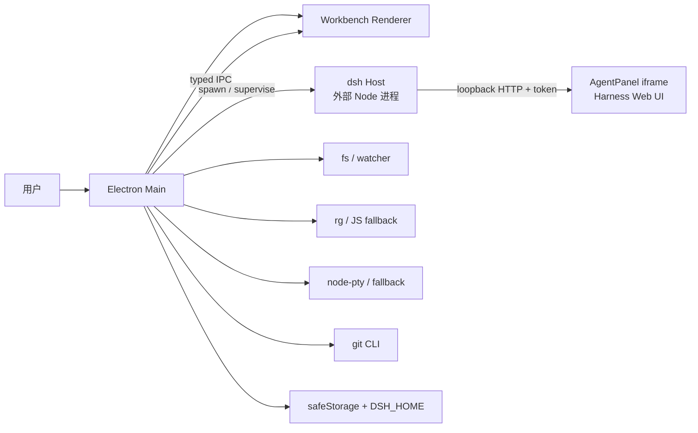
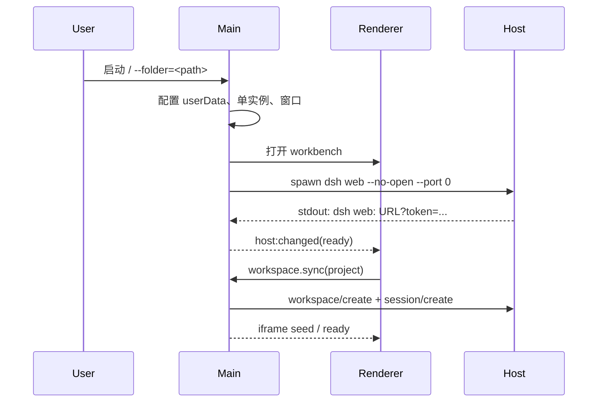
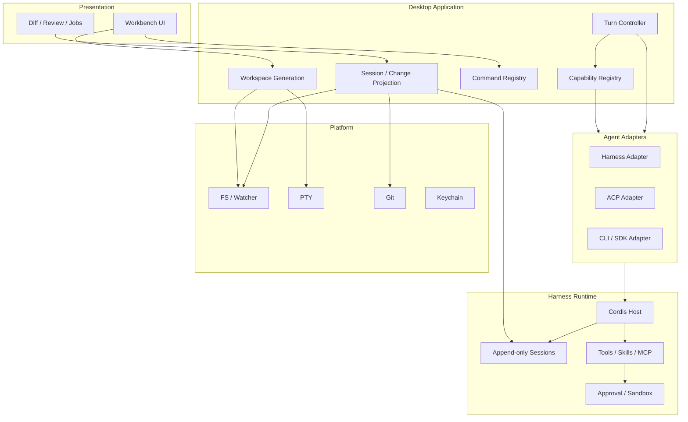

# 架构文档（As-Built + Target seams）

> 本文首先描述当前代码真实存在的架构，再单独标出正在建设的设计缝。当前基线为 `f163779`，Harness gitlink 为 `00102833d`（`dsh-v0.1.7-alpha.2`）。未来目标见 [`roadmap.md`](roadmap.md)，市场与竞品取舍见 [`market-research.md`](market-research.md)。

## 1. 产品不变量

这些规则优先于局部实现便利：

1. **Harness 是 Agent runtime 权威**：Agent loop、模型调用、工具、Skills、MCP、审批、沙箱和 Session log 由上游 Host 拥有。
2. **Main 不执行 Agent 工具**：Electron Main 只做窗口、平台能力、进程监督、IPC 和桌面服务。
3. **Renderer 无 Node 权限**：`contextIsolation: true`、`nodeIntegration: false`，只通过 preload 的类型化白名单。
4. **Session/model-visible context 不复制**：DHD 不建立第二个聊天历史；未来投影必须能回到 Harness Session log。
5. **所有外部副作用有 owner 和 dispose**：watcher、搜索、PTY、Host、窗口、事件订阅和子进程必须能取消、等待和清理。
6. **文件不是事务**：Agent 写盘、用户编辑、格式化器和 Git 可能并发；projection 必须检测冲突，不能假装原子提交。
7. **开发、源码、打包、发行是不同状态**：没有签名和安装后验证的构建只能称为 source/preview。
8. **Harness pin 是兼容面**：Host 命令、ready line、HTTP route、preset、Session format 和 localStorage key 都必须随 pin 复核。

## 2. 当前拓扑



### 2.1 进程职责

| 进程 | 技术 | 当前职责 | 明确禁止 |
|---|---|---|---|
| Main | Electron + TypeScript | 窗口/菜单/单实例、Host supervisor、fs/git/search/pty/mcp/凭证、IPC | 不执行 Agent tool、不改 Session log、不挂载 Cordis |
| Renderer | React + Vite + Monaco + xterm | 文件树、编辑、搜索/终端/Git 视图、设置、Agent iframe | 不 import Electron/Node，不持有裸 IPC |
| Host | 上游 Harness + Cordis | Agent loop、工具、模型、Skills、MCP、Session、审批和沙箱 | 不由桌面端 fork 或复制 |

### 2.2 当前 Agent surface

`apps/workbench/src/AgentPanel.tsx` 当前用带 token 的 URL 加载 `<iframe>`。它是兼容和功能保真路径，不是已经完成的原生 `dsh-client` 嵌入，也不是 `webviewTag`。

```text
Host ready URL
   │
   ▼
AgentPanel <iframe src="http://127.0.0.1:<port>/?token=...">
   │
   └── 当前完整 Harness Web UI：preset、Trajectory、工具卡、Skills、MCP、Session
```

目标是将 transport 和 projection 抽出，使 iframe 可替换；在 contract 测试通过前不删除这条路径。

## 3. 当前代码地图

```text
apps/shell/src/
├── main.ts                 # 单实例、开发实例、窗口注册、Host 启动、shutdown coordinator
├── windows.ts              # BrowserWindow 安全选项和 workbench 加载
├── menu.ts                 # 原生菜单 → menu:command
├── ipc.ts                  # 唯一 ipcMain 注册入口、项目 watcher、能力 manifest
├── host.ts                 # HostProcess 状态机、ready URL、owned/adopted 生命周期
├── harness-api.ts          # Host HTTP RPC 和 iframe workspace/session seed
├── paths.ts                # Harness root、DSH_HOME、userData 和 profile 路径
├── fs-service.ts           # 文件读写、目录和原生对话框
├── git-service.ts          # git CLI 封装
├── project-watcher.ts      # 原生递归 fs.watch，目录级 fallback
├── search-service.ts       # rg 流式搜索、取消、JS fallback
├── pty-service.ts          # node-pty 和多级 fallback
├── mcp-service.ts          # MCP overlay
├── settings-store.ts       # Desktop settings
├── credentials.ts          # safeStorage + DSH_HOME credential ref
├── inline-edit.ts          # Cmd/Ctrl+K 的模型调用
├── updater.ts              # electron-updater 骨架
└── preload.ts              # 白名单 API，不暴露通用 invoke

apps/workbench/src/
├── state.tsx               # Renderer 状态、项目/编辑器/Host 订阅
├── Workbench.tsx           # Activity Bar、Sidebar、Editor、Panel、Agent
├── AgentPanel.tsx          # iframe surface 和选区 fallback
├── EditorArea.tsx           # Monaco 多 Tab
├── Explorer.tsx            # 文件树
├── SearchPanel.tsx         # 流式搜索/取消/错误态
├── TerminalPanel.tsx       # xterm + PTY
├── ScmPanel.tsx            # Git
├── ChangesPanel.tsx         # 仓库级 diff
├── CommandPalette.tsx      # 快开/命令
├── InlineEdit.tsx           # 行内编辑
├── SettingsPanels.tsx       # 设置/MCP/Rules
└── Welcome.tsx              # 打开/克隆/最近项目

packages/shared/src/
├── protocol.ts             # 领域类型、IpcChannel、IpcEventMap
├── api.ts                  # DesktopApi 唯一类型
├── capabilities.ts         # 版本化 capability manifest
└── index.ts                # package 导出
```

## 4. 跨进程 contract

### 4.1 类型和通道

`packages/shared/src/protocol.ts` 是通道和事件类型的真源；`api.ts` 是 Renderer 可见 API 的真源。Main、preload、Renderer 三者必须同步更新。

新增能力的流程：

```text
定义可序列化 payload
  → protocol.ts 增加 IpcChannel / IpcEventMap
  → api.ts 增加最小 DesktopApi 方法
  → ipc.ts 注册 handler
  → preload.ts 只转发白名单方法
  → Renderer 消费并处理失败/取消
  → 文档、测试和版本兼容记录
```

preload 不再暴露 `invoke(channel, ...args)`。Renderer 不能绕过 API 对象直接调用任意 IPC 通道。

### 4.2 Capability manifest

`app.capabilities` 返回 `DesktopCapabilities`，包含：

- `contractVersion`：桌面 contract 版本；
- `appVersion`；
- `surface`：`managed-iframe` 或 `external-loopback`；
- Host 是否由桌面拥有及其状态；
- 每个桌面能力的 `available/degraded/unavailable` 状态和实现说明。

它是“能力发现”入口，不是安全授权。Host 每次状态迁移还会广播 `capabilities:changed`，Renderer 不应把启动时的 snapshot 当作永久事实。未来 adapter/plugin 应读取该 manifest，并明确声明自己支持的能力；未知能力必须返回 `unsupported`，不能静默假装成功。

### 4.3 当前 IPC 分类

| 分类 | 例子 | 所有者 |
|---|---|---|
| 应用/窗口 | version、platform、capabilities、settings、window | Main |
| 项目/fs | open、read/write、watch、reveal | Main + platform |
| 搜索 | files、content、progress、cancel | Main |
| Git | status、diff、stage、commit、push、pull | Main + git CLI |
| 终端 | acquire、write、resize、kill、data/exit | Main + PTY |
| Agent/Host | host status/restart、workspace sync | Main + Harness Host |
| 配置 | credentials、MCP、rules、inline edit | Main + Harness/platform |

## 5. 启动、运行和退出时序

### 5.1 启动



实际顺序是：Main 先注册 IPC、打开窗口，再启动 Host；Host ready 通过事件广播。外部 `DHD_HARNESS_URL` 优先于本地 spawn。

### 5.2 Host 状态机

```text
stopped → starting → ready
                   ↘ error
ready → stopped（重启/退出）
```

- `DHD_HARNESS_URL` 合法：采用 loopback URL，标记为 external，桌面不拥有其进程；非 loopback 只有显式 `DHD_ALLOW_REMOTE_HOST=1` 才会被接受。
- 否则：探测 Harness root，使用本机 Node 启动 `dsh web`。
- ready 只由 stdout 的 `dsh web: <url>` 解析确认；启动超时、进程提前退出和无效 URL 进入 error。
- 自有 Host 退出先 TERM，2 秒后 KILL，并等待真实退出；外部 Host 不由桌面终止。

### 5.3 统一退出

`before-quit` 可重入地拦截退出：

1. 设置 shutdown 状态，停止项目 watcher。
2. 取消所有搜索并等待清理。
3. 销毁窗口。
4. 并行等待 PTY 和自有 Host 退出。
5. 清理完成后才再次 `app.quit()`。

macOS 关闭最后一个窗口默认不等于退出应用；Dock“退出”才触发完整清理。这是平台语义，不是资源泄漏。

## 6. 数据所有权

| 数据 | 权威 owner | 桌面是否复制 |
|---|---|---|
| Agent Session / Trajectory / Tool result | Harness Host / `$DSH_HOME` | 否 |
| Agent preset、MCP patch、Skills | Harness profile / `$DSH_HOME` | 只生成桌面 overlay |
| Desktop settings、窗口布局、最近项目 | Electron `userData` | 是，明确独立 |
| API Key | safeStorage + DSH credential reference | 加密/兼容同步，不进 Session |
| 编辑器 buffer/dirty state | Renderer | 临时，断线后以磁盘为准 |
| PTY session | Main，按 window/project owner | 短暂回放 buffer |
| 项目文件 | 磁盘 | watcher 只发事件，不做事务写入 |
| Git 状态 | git working tree/index | 缓存可重建 |

同一 `DSH_HOME` 不等于每个 Agent 独立；实验性 Agent Teams 也共享 checkout。需要隔离时必须使用独立 worktree/进程/数据目录。

## 7. 搜索、watcher 和 PTY 的资源原则

### 7.1 Watcher

项目 watcher 使用原生递归 `fs.watch`，只为目录保留监听；不支持递归的平台按目录 fallback。关闭项目、窗口和应用时必须释放。不要恢复“每个文件一个长期 watcher”的实现。

### 7.2 Search

`search-service.ts` 优先使用 `rg --json`，流式报告进度、限制命中数并支持取消。启动失败、同步异常、异步错误或非正常退出必须回退 JavaScript 遍历；UI 区分“搜索失败”和“没有匹配”。

### 7.3 PTY

PTY session 由 Main 按 window/project owner 持有，切换底部 Tab 只分离视图；重新 acquire 时回放有限 buffer。node-pty、Python bridge、`script` 和管道 fallback 都必须把 spawn error、resize 能力和退出码暴露给 UI。

## 8. 安全模型

### 8.1 Renderer

- `contextIsolation: true`
- `nodeIntegration: false`
- preload 白名单，无任意 channel invoke
- URL/Host token 只在当前兼容 iframe 路径使用；未来 transport 应减少 Renderer 持有启动 token
- 外部链接、目录、文件和 shell 操作由 Main 校验

### 8.2 Host 和工具

Host 仍是执行用户 Agent 工具的 Node 进程。Electron 的 renderer sandbox 不等于 Agent sandbox；审批、权限和 OS sandbox 必须由 Harness/平台真正执行。外部 Host、插件和 MCP 都应视为能影响用户工作区的代码。

### 8.3 凭证和日志

- API Key 使用 safeStorage；兼容文件权限为 0600。
- 不在 README、fixture、CHANGELOG 或普通日志写 token、key、完整 credential 配置。
- 错误展示应有界并脱敏；保留启动阶段和可定位原因。

## 9. 目标架构：可替换缝

### 9.1 目标拓扑



### 9.2 Workspace Generation

一个项目窗口对应一个 generation，至少拥有：

- project root 和窗口/Host lease；
- watcher/search/PTY owner；
- Agent surface 与 session selection；
- effective settings snapshot；
- event subscription 和 teardown barrier。

切换项目、关闭窗口、重启 Host 和切换 profile 都必须创建/销毁 generation；旧 generation 的回调不能写入新 UI。

### 9.3 TransportDriver

目标 interface（概念，不是当前已实现 API）：

```ts
interface TransportDriver {
  connect(request: ConnectRequest): Promise<Connection>
  sendTurn(input: TurnInput): Promise<TurnHandle>
  cancel(turnId: string, reason?: string): Promise<void>
  resume(sessionId: string): Promise<SessionView>
  subscribe(listener: (event: AgentEvent) => void): () => void
  capabilities(): CapabilityManifest
  dispose(): Promise<void>
}
```

实现顺序：现有 loopback/iframe → Host IPC bridge → 外部 ACP/CLI。每个实现都必须有相同 contract test，尤其是取消、重连、事件顺序和 dispose。

### 9.4 Change Projection

```text
SessionEvent / tool result
          +
watcher / Git status
          ↓
TurnChangeSet { turnId, path, before, after, source, status }
          ↓
Review UI / test command / apply-or-revert decision
```

Projection 是只读派生视图；它不能悄悄覆盖用户 buffer。冲突、reload、外部写和未知来源必须显式显示。

## 10. 扩展和插件模型

当前 DHD 还没有稳定的第三方 Desktop 扩展 API。目标 API 应遵循三层：

1. **Service Definition**：公开、版本化的最小接口。
2. **Service Provider**：Harness plugin、Desktop adapter 或平台实现。
3. **Consumer**：Workbench、Agent surface 或其它插件。

每个注册都要有 disposer；每个权限都要有来源和用户确认；每个插件版本都要声明兼容的 Desktop contract 和 Harness pin。普通 DSH plugin 应尽量只依赖上游 DSH contract，以便在 Web、CLI 和 Desktop 复用。

## 11. 多 Agent 语义

| 名称 | 当前 owner | 桌面承诺 |
|---|---|---|
| 一次性 subagent | Harness preset | 保留上游语义，显示在 iframe Trajectory |
| 可继续 subagent | Harness preset | 未来可投影 child session/status |
| fork | Harness preset | 未来显示上下文来源，不复制日志 |
| Workflow | Harness preset | 未来显示 run/job，不宣称跨进程可靠投递 |
| Agent Teams | 上游 experimental package | opt-in；明确单进程、共享 checkout、advisory scopes |
| ACP/CLI/SDK provider | 上游/外部 | 通过 adapter contract 接入，未接入前不宣传支持 |
| 多个 coding agent 改 DHD | 仓库协作 | 独立 worktree、DSH_HOME、userData、端口和交接记录 |

## 12. 打包和上游兼容

当前 `electron-builder.yml` 打包 shell、workbench、desktop profile 和 PTY bridge，但没有完整 Harness/Node runtime。目标发布单元必须把以下内容绑定为一个版本：

```text
Desktop shell
+ exact Harness runtime
+ Node/pnpm/native dependencies
+ desktop profile
+ resources and migration metadata
```

升级 Harness 时：

1. 单独更新 gitlink。
2. 在 Harness checkout 安装/构建。
3. 重新检查 Host 命令、ready line、token、workspace/session route、preset、iframe boot 和 Session format。
4. 运行真实 Host smoke 和桌面关键流程。
5. 更新 support matrix、CHANGELOG、回滚说明。
6. 不把 pin bump 和无关 UI 功能混在同一提交。

## 13. 已知限制与下一步

当前限制详见 [`support-matrix.md`](support-matrix.md)。优先级最高的架构动作：

1. 为 Host、PTY、watcher、search、workspace sync 建行为测试。
2. 把 capability manifest 从描述性 API 扩展为 adapter negotiation。
3. 实现 per-window Workspace Generation 和开发实例隔离的自动化验证。
4. 以 turn controller + change projection 替代手工 iframe 深度融合。
5. 在任何发行宣传前完成 runtime manifest、签名、原生安装和回滚证据。

相关决策记录：[`0001`](adr/0001-runtime-boundary.md)、[`0002`](adr/0002-agent-transport.md)、[`0003`](adr/0003-capability-negotiation.md)、[`0004`](adr/0004-upstream-first-evaluation.md)。
